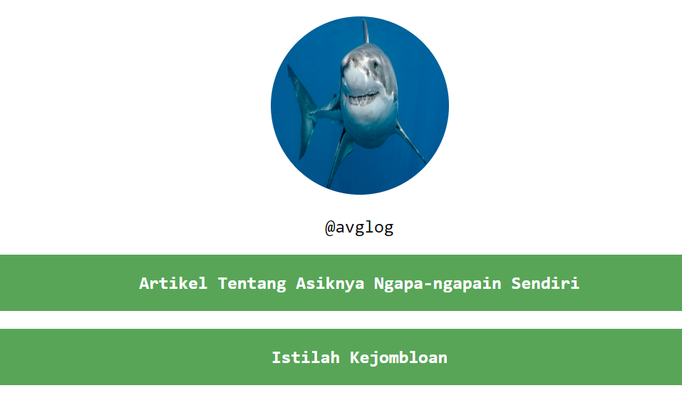

# TAMPILAN WEBSITE LINKTREE

> Sebuah tampilan dari WEBSITE LinkTree abal.

**Tampilan Website LinkTree** adalah versi sederhana dan custom dari situs LinkTree yang memungkinkan pengguna untuk menampilkan beberapa tautan di satu halaman. Cocok untuk digunakan sebagai landing page sederhana yang menghubungkan berbagai profil media sosial, situs web, atau portofolio.

## Fitur
- **Navigasi Sederhana**: Menampilkan beberapa tautan dengan tampilan yang simpel dan mudah diakses.
- **Custom Link**: Pengguna dapat menyesuaikan tautan yang ingin ditampilkan.

## Cara Memakai
1. Edit bagian link di file HTML sesuai dengan tautan yang ingin kamu tampilkan.
2. Upload file ke hosting atau gunakan langsung sebagai halaman landing page pribadi.
3. Bagikan tautan halaman LinkTree kamu ke media sosial atau tempat lainnya untuk memudahkan orang lain menemukan profil dan kontenmu.

## Teknologi yang Digunakan
- HTML
- CSS

---

